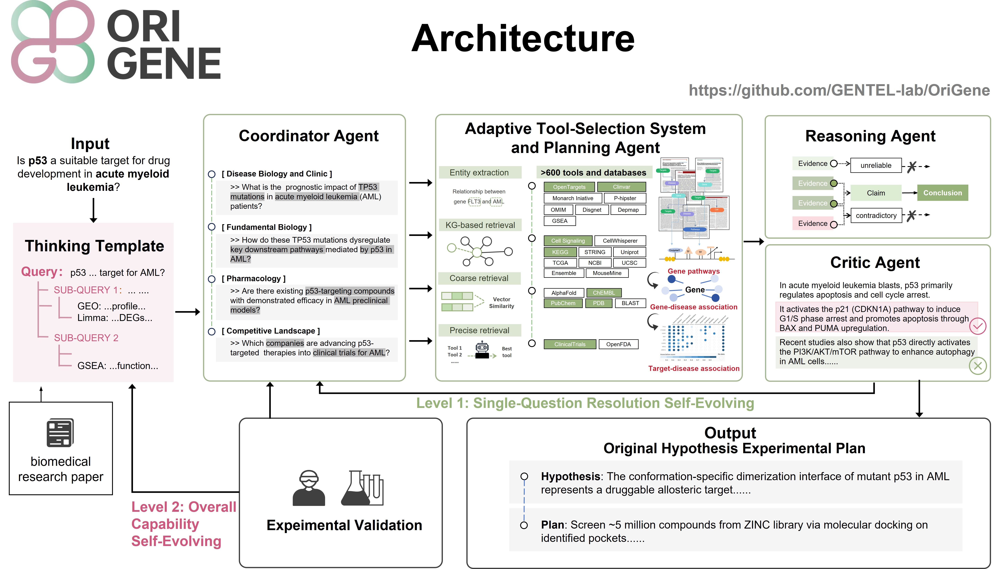

# OriGene: A Self-Evolving Virtual Disease Biologist Automating Therapeutic Target Discovery

> **Important**: This is the Beta release of OriGene, the self-evolving multi-agent system that acts as a virtual disease biologist.
> We also introduce the TRQA Benchmark — a benchmark of 1,921 expert-level questions for evaluating biomedical AI agents.
> We will continue to release updated code over time.

  | <a href="https://gentel-lab.github.io/OriGene-Homepage">Homepage</a> |
  <a href="https://gentel-lab.github.io/OriGene-Paper/OriGene.pdf">Paper</a> |
  <a href="https://github.com/GENTEL-lab/OriGene">Code</a> |
  <a href="https://huggingface.co/datasets/GENTEL-Lab/TRQA/">Hugging Face Benchmark</a> |

## 1. OriGene Overview

Therapeutic target discovery remains one of the most critical yet intuition-driven stages in drug development. We present **OriGene**, a self-evolving multi-agent system that functions as a virtual disease biologist to 
identify and prioritize therapeutic targets at scale. 

## 2. TRQA Benchmark Description
To evaluate performance, we constructed TRQA, a benchmark of 1,921 questions specific to therapeutic target identification tasks across multiple disease areas. 

**Target Research-related Question Answering (TRQA)** is a comprehensive evaluation benchmark designed to assess the capabilities of OriGene and similar systems in biomedical reasoning and target discovery.

TRQA evaluates core competencies including:  
- Scientific planning  
- Information retrieval  
- Tool selection  
- Reasoning toward biological conclusions  
- Critical self-evolution  

It spans domains such as fundamental biology, disease biology, pharmacology, and clinical medicine, integrating both scientific literature and real-world data from drug development pipelines and clinical trials.

**TRQA includes two subsets**:
- **TRQA-lit**: Focuses on recent research findings. Includes 172 multiple-choice questions (for rapid model/human comparison) and 1,108 short-answer questions covering key biomedical areas.
- **TRQA-db**: Centers on competitive landscape analysis. Includes 641 short-answer questions that evaluate the ability to retrieve, integrate, and reason over data related to drug R&D and clinical trials.

## 3. Evaluation Results
**Target Research-related Question Answering (TRQA) benchmark leader board**
| Method             | TRQA-lit Choice (Core Set) | TRQA-lit Short-Answer  | TRQA-db  |
|--------------------|----------------------------------|--------------------------------|------------------|
| OriGene            | 0.601                            | 0.826                          | 0.721            |
| o3-mini            | 0.578                            | 0.720                          | 0.487            |
| Claude-3.7-Sonnet  | 0.558                            | 0.695                          | 0.504            |
| DeepSeek-R1        | 0.548                            | 0.714                          | 0.446            |
| DeepSeek-V3        | 0.541                            | 0.768                          | 0.466            |
| GPT-4o-search      | 0.531                            | 0.651                          | 0.493            |
| Gemini-2.5-pro     | 0.529                            | 0.678                          | 0.359            |
| GPT-4o             | 0.512                            | 0.696                          | 0.392            |
| TxAgent            | 0.190                            | 0.472                          | 0.426            |
| Human Group 3 (PhD + 3-5 year exp.)  | 0.523                            | ✗                          | ✗            |
| Human Group 2 (PhD + 1-3 year exp.)  | 0.378                            | ✗                          | ✗            |
| Human Group 1 (senior PhD candidates)  | 0.215                            | ✗                          | ✗            |

## 4. Tools Sets

OriGeneTools integrates over 500 tools to support target discovery and biomedical reasoning.

- On the left, tools are grouped by **multi-omics domians** (e.g., genomics, transcriptomics, proteomics, phenomics, clinical evidence), highlighting OriGene’s ability to process biological data across scales.

- On the right, the same tools are reorganized by **biomedical knowledge domains**: fundamental biology, disease biology, pharmacology, and competitive landscape, reflecting how OriGene supports expert-level reasoning across diverse therapeutic tasks.

## 5. Demo

## 6. License

This code repository is licensed under [the Creative Commons Attribution-Non-Commercial ShareAlike International License, Version 4.0 (CC-BY-NC-SA 4.0)](https://creativecommons.org/licenses/by-nc-sa/4.0/) (the "License"); you may not use this file except in compliance with the License. You may obtain a copy of the License at https://github.com/GENTEL-lab/OriGene/blob/main/LICENSE.

## 7. Contact

If you have any questions, please raise an issue or contact us at [shuangjia.zheng@sjtu.edu.cn](mailto:shuangjia.zheng@sjtu.edu.cn) or [zhongyuezhang@sjtu.edu.cn](mailto:zhongyuezhang@sjtu.edu.cn).

## 8. Acknowledgements

Thanks to DeepSeek, ChatGPT, Claude, and Gemini for providing powerful language models that made this project possible.

Special thanks to the human experts who assisted us in benchmarking and evaluating the agent's performance!

## The full source code is coming soon!
