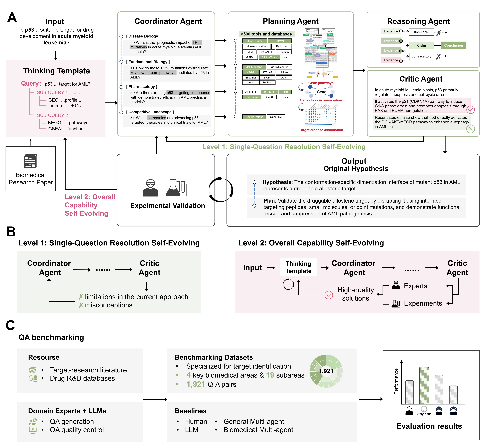
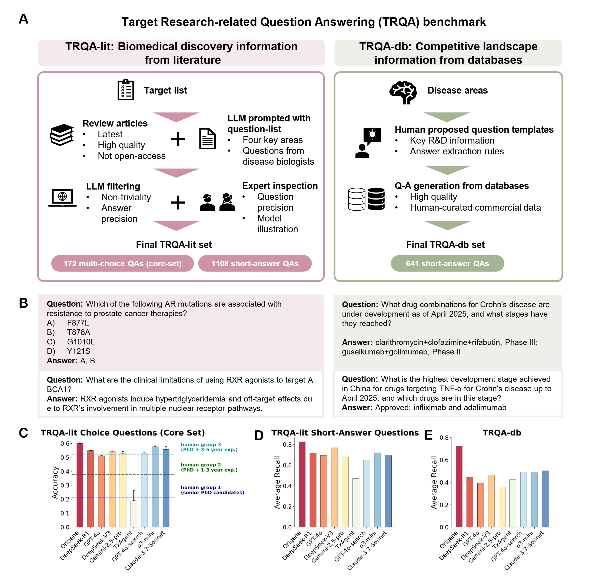

<h1 style="display: flex; align-items: center;">
   :  A Self-Evolving Virtual Disease Biologist Automating Therapeutic Target Discovery
</h1>

# OriGene: A Self-Evolving Virtual Disease Biologist Automating Therapeutic Target Discovery

| [Homepage](https://GENTEL-lab.io/OriGene) | [Paper](https://www.paperexample.com) | [Code](https://github.com/GENTEL-lab/OriGene) | [Hugging Face Benchmark](https://huggingface.co/datasets/GENTEL-Lab/TRQA/) | 

## OriGene Overview

Therapeutic target discovery remains one of the most critical yet intuition-driven stages in drug development. Despite the growing availability of 
multi-omics and functional genomics data, current computational approaches lack a generalizable framework for mechanistically guided target 
nomination across disease types. Here, we present **OriGene**, a self-evolving multi-agent system that functions as a virtual disease biologist to 
identify and prioritize therapeutic targets at scale. OriGene integrates diverse agents representing functional networks, transcriptomic perturbations, 
disease ontologies, and literature-derived evidence, enabling mechanistic reasoning and scientifc hypothesis generation from heterogeneous inputs. 
To evaluate OriGene, we constructed a benchmark of 1,921 questions specific to therapeutic target identification tasks across multiple disease areas. 
Our results show that OriGene outperforms existing research agents, network- and embedding-based approaches on precision, coverage, and robustness to 
sparse or noisy data. Case studies demonstrate its ability to recover both clinically validated and less studied targets. OriGene establishes 
a scalable framework for AI-assisted disease mechanism inference and therapeutic hypothesis generation.

## TRQA Benchmark Description

**Target Research-related Question Answering (TRQA) benchmark for evaluating biomedical knowledge and target identification skillsets.**
**(A)** Overview of TRQA benchmark comprising two complementary datasets: TRQA-lit derives questions from biomedical literature through LLM filtering and expert curation, yielding 172 multiple-choice and 1,108 short-answer questions; TRQA-db generates 641 short-answer questions from structured databases using human-designed templates and extraction rules.
**(B)** Representative question examples from both datasets with corresponding answers.
**(C-E)** Performance evaluation results showing accuracy for multiple-choice questions **(C)** and average recall for short-answer questions from literature **(D)** and database sources **(E)** across different systems, with human performance benchmarks indicated for reference groups of varying expertise levels.

## Target Research-related Question Answering (TRQA) benchmark leader board
| Method             | TRQA-lit Choice (Core Set) | TRQA-lit Short-Answer  | TRQA-db  |
|--------------------|----------------------------------|--------------------------------|------------------|
| Origene            | 0.601                            | 0.826                          | 0.721            |
| o3-mini            | 0.578                            | 0.720                          | 0.487            |
| Claude-3.7-Sonnet  | 0.558                            | 0.695                          | 0.504            |
| DeepSeek-R1        | 0.548                            | 0.714                          | 0.446            |
| DeepSeek-V3        | 0.541                            | 0.768                          | 0.466            |
| GPT-4o-search      | 0.531                            | 0.651                          | 0.493            |
| Gemini-2.5-pro     | 0.529                            | 0.678                          | 0.359            |
| GPT-4o             | 0.512                            | 0.696                          | 0.392            |
| TxAgent            | 0.190                            | 0.472                          | 0.426            |
| Human Group 3 (PhD + 3-5 year exp.)  | 0.523                            | ✗                          | ✗            |
| Human Group 2 (PhD + 1-3 year exp.)  | 0.378                            | ✗                          | ✗            |
| Human Group 1 (senior PhD candidates)  | 0.215                            | ✗                          | ✗            |

## The full source code is coming soon!
